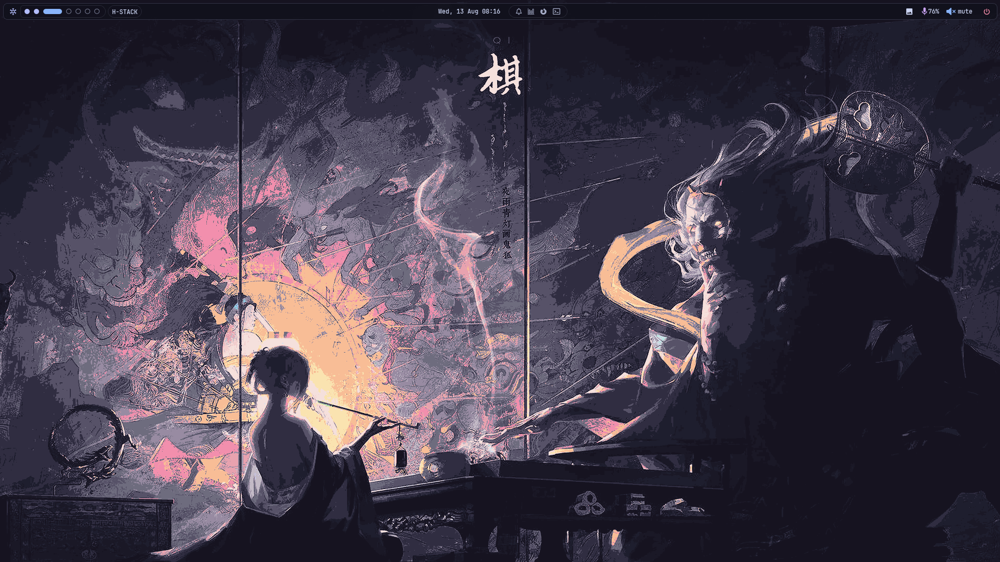
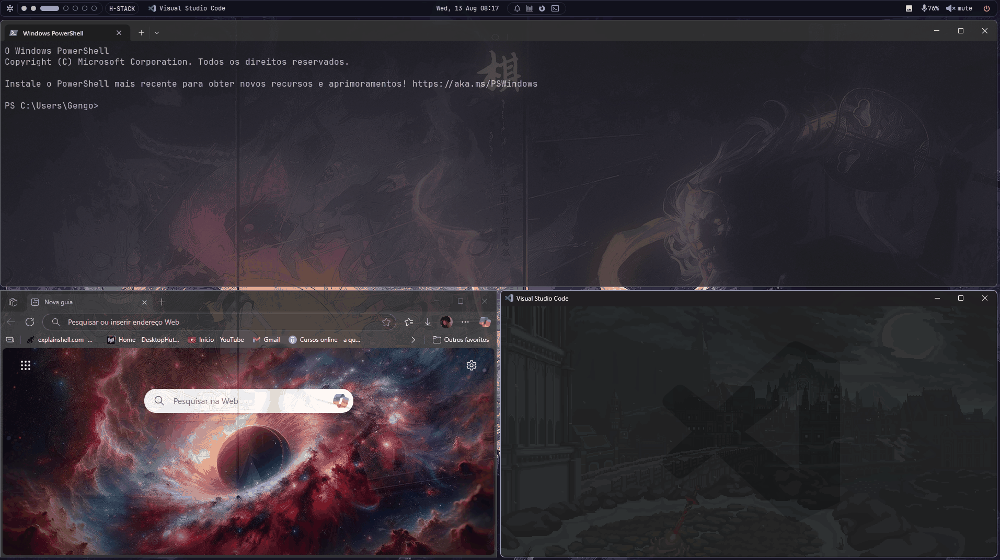
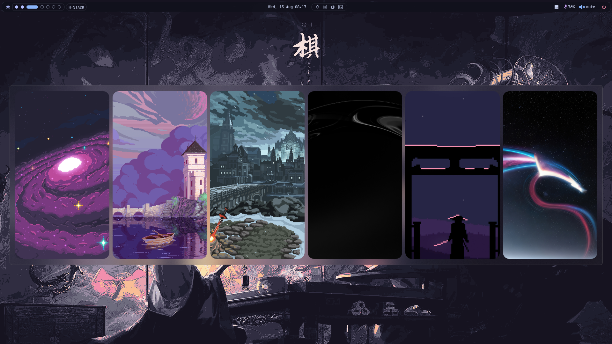

# 🪟 Windows Tiling Setup — Komorebi + YASB

<p align="center">
  <!-- OS / Stack -->
  
  
  
  
  
  <!-- GitHub meta -->
  <a href="https://github.com/Gengo250/Config_Windows_Yasb/stargazers">
    
  </a>
  <a href="https://github.com/Gengo250/Config_Windows_Yasb/issues">
    
  </a>
  
  
</p>

> Layouts tiling leves no Windows com **Komorebi** (gerenciador de janelas) e **YASB Reborn** (status bar). Este repositório traz meus arquivos de configuração, tema, atalhos e instruções para reproduzir exatamente o setup das capturas abaixo.






---

## ✨ O que vem pronto

- **Layouts automáticos** com o Komorebi (`h-stack`, _monocle_, _columns_…)
- **Barra superior minimalista** com bateria, rede, volume, relógio, mídia e workspaces (**YASB**)
- **Hotkeys** para mover/organizar janelas rapidamente (via **whkd**)
- **Tema escuro** + **JetBrainsMono Nerd Font** com ícones (indicadores bonitos na barra)
- Scripts de inicialização e estrutura de pastas organizada


---

## ⬇️ Downloads necessários

Você pode instalar tudo **via `winget`** (recomendado) ou baixar manualmente nas páginas oficiais.

### Via `winget` (PowerShell/Terminal)

```powershell
# PowerShell moderno (opcional, mas recomendado)
winget install --id Microsoft.PowerShell -e

# Fonte com ícones para a barra
winget install --id NerdFonts.JetBrainsMono -e

# Komorebi (gerenciador) + whkd (daemon de hotkeys)
winget install --id LGUG2Z.komorebi -e

# YASB Reborn (status bar)
# Se o pacote não existir no winget da sua máquina, use o instalador da página do projeto.
winget install --id amnweb.YASBReborn -e
```

### Manual (caso prefira)

1. **Komorebi** (traz `komorebic.exe`): baixe no _Releases_ do projeto **LGUG2Z/komorebi** e extraia em uma pasta no seu PATH.
2. **whkd**: disponível no mesmo repositório; copie `whkd.exe` para a mesma pasta do `komorebic.exe` ou outra pasta no PATH.
3. **YASB Reborn**: baixe o instalador do repositório **amnweb/yasb** e instale normalmente.
4. **JetBrainsMono Nerd Font**: instale a variante *Nerd Font* (TTF/OTF) para habilitar ícones na barra.

> **Observação**: nomes/IDs dos pacotes podem variar conforme a sua fonte do Winget. Se algum ID não for encontrado, instale pelo _Release_ do respectivo GitHub.

---

## ⚙️ Configuração passo a passo

> **Pré‑requisito**: clone este repositório em uma pasta da sua preferência e mantenha a estrutura acima.

### 1) Komorebi + whkd

Crie a pasta de configuração e copie o arquivo:

```powershell
# Pasta padrão do Komorebi
mkdir "$HOME\.config\komorebi" -ea 0
Copy-Item ".\komorebi\komorebi.json" "$HOME\.config\komorebi\komorebi.json" -Force

# Atalhos do whkd
Copy-Item ".\whkd\whkdrc" "$HOME\.config\whkdrc" -Force
```

Inicie o serviço com hotkeys:

```powershell
komorebic start --whkd
```

> Se o comando não for reconhecido, adicione a pasta contendo `komorebic.exe` ao **PATH** do sistema ou abra um novo terminal.

### 2) YASB Reborn (barra)

Abra o YASB uma vez para ele criar a pasta de configuração e **feche**. Em seguida:

```powershell
# Caminho típico (pode variar conforme instalação)
$yasb = "$env:LOCALAPPDATA\YASB"
mkdir $yasb -ea 0
Copy-Item ".\yasb\config.yaml" "$yasb\config.yaml" -Force
Copy-Item ".\yasb\styles.css" "$yasb\styles.css" -Force

# Inicie/pare pelo cli
yasbc start
# yasbc stop
```

> Alternativa: pelo aplicativo, use **Settings → Open config folder** e cole os arquivos manualmente.

### 3) Autostart no Windows

Crie atalhos na pasta **Inicializar**:

```powershell
# Abre a pasta de inicialização do usuário
explorer shell:startup
```

- **Atalho 1**: para `komorebic.exe` com argumentos `start --whkd`
- **Atalho 2**: para `YASB.exe` (ou use `yasbc start` em um `.bat`)

Ou use o script pronto deste repo:

```powershell
Copy-Item ".\scripts\start-komorebi.bat" "$env:APPDATA\Microsoft\Windows\Start Menu\Programs\Startup\start-komorebi.bat" -Force
```

---

## ⌨️ Hotkeys (meu template)

> Edite em `whkd/whkdrc`. Exemplos comuns (ajuste ao seu gosto):

```
# Mod: ALT (pressione junto das teclas)
alt + h         # foco: janela à esquerda
alt + l         # foco: janela à direita
alt + j         # foco: janela abaixo
alt + k         # foco: janela acima

alt + shift + h # mover janela para esquerda
alt + shift + l # mover janela para direita
alt + shift + j # mover janela para baixo
alt + shift + k # mover janela para cima

alt + enter     # tornar janela monocle
alt + space     # alternar layout (stack/tiles/columns)
alt + q         # fechar janela focada
alt + t         # flutuar / desfazer flutuação

# workspaces
alt + 1..9      # ir para workspace
alt + shift + 1..9 # enviar janela para workspace
```

---

## 🎨 Tema & Fonte

- **Fonte**: *JetBrainsMono Nerd Font* — selecione nas configurações do YASB e, se quiser, como fonte do Terminal/VS Code.
- **Cores**: o `styles.css` traz variáveis pensadas para tema escuro. Ajuste conforme seu wallpaper.
- Ícones da barra dependem da **Nerd Font** instalada (verifique se a família selecionada é a variante *Nerd*).

---

## 🧰 Dicas & Solução de Problemas

- **YASB não abre / “Pipe not found”**: rode `yasbc start` após fechar o aplicativo; confirme que o **.NET Desktop Runtime** está instalado; tente reiniciar a sessão.
- **Hotkeys não funcionam**: confirme se `whkd.exe` está em execução (o comando `komorebic start --whkd` deve iniciá-lo) e se o arquivo `~/.config/whkdrc` existe.
- **Ícones quadrados na barra**: troque a fonte para **JetBrainsMono Nerd Font** nas configurações do YASB e do seu terminal.
- **komorebic não reconhecido**: adicione a pasta do executável ao **PATH** e abra um novo terminal.

---

## 🔧 Personalização rápida

- **Layouts**: edite `komorebi/komorebi.json` para definir `h-stack`, `columns`, gaps, _padding_, bordas e regras por aplicativo.
- **Módulos da barra**: edite `yasb/config.yaml` para ativar/desativar módulos (CPU/RAM/bateria/mídia/network/clock/workspaces).
- **Atalhos**: ajuste o `whkdrc` para seu esquema preferido (ex.: `win` como **mod**, ou Vim-like em `HJKL`).

---

## 🤝 Créditos

- **Komorebi** — gerenciador de janelas para Windows (by LGUG2Z e contribuidores).
- **YASB Reborn** — barra modular para Windows (by amnweb e contribuidores).
- Comunidade de temas/ícones Nerd Fonts.

---

## 📜 Licença

Este repositório está sob a licença **MIT**. Sinta‑se livre para forkar, adaptar e enviar PRs.

---

## 👤 Autor

**Miguel de Castilho Gengo**  
Estudante de Engenharia de Computação (PUC-Campinas) • Dev C/Java/Python • Robótica & Cibersegurança

**Links**
- GitHub: [@Gengo250](https://github.com/Gengo250)
- LinkedIn: [miguel-gengo-8157b72a1](https://www.linkedin.com/in/miguel-gengo-8157b72a1)
- E-mail: [miguelgengo28@gmail.com](mailto:miguelgengo28@gmail.com)

Se este setup te ajudou, deixa uma ⭐ no repositório e sinta-se à vontade para abrir uma *Issue* com sugestões.


---

> **Resumo**: este template deixa o Windows com produtividade de _tiling WM_ sem abrir mão da compatibilidade. Clone, copie as configs, inicie `komorebic` e `yasbc` e aproveite.
